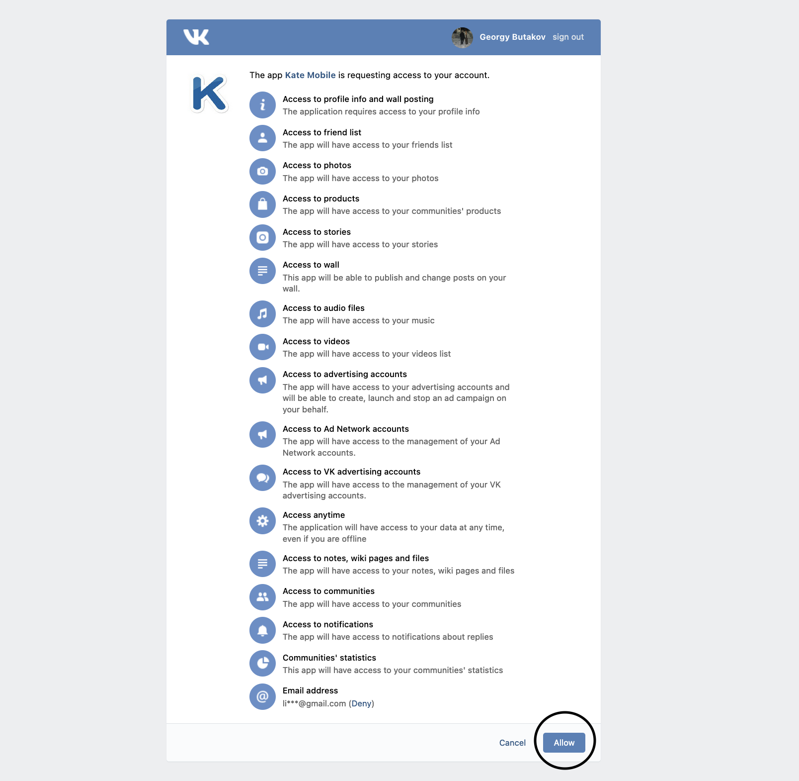
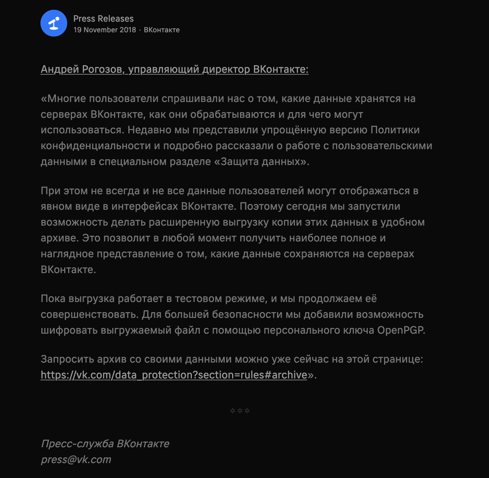
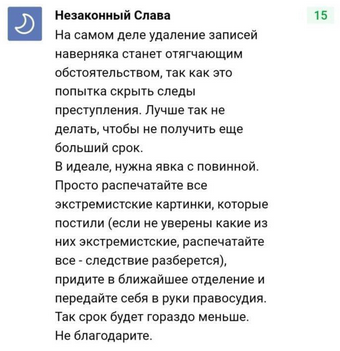

# Пока, vk!
Набор скриптов, позволяющий удалить диалоги, альбомы, видео, лайки с
твоей страницы vk.com

# Предисловие
Сурсы были взяты и модифицированы с [данного репозитория](https://github.com/neseleznev/bye_vk)

## Мотивация

 

Причины почистить, а то и выпилиться из соц.сетей у всех могут быть свои. Например:
 * Каждый день в России заводят уголовные дела за лайки, репосты и
 картинки в ВК и Одноклассниках. Если Вы считаете, что Вас не за что
 привлечь, пройдёмте, гражданин, [по ссылочке](https://medialeaks.ru/2907bva-idyom-na-posadku/),
 там расскажут
 * Боязнь компрометации при взломе, ведь никому не хочется, чтобы
 фотографии друзей и подруг попали в руки злоумышленников. Как вариант,
 можно выгрузить ЛС, альбомы с комментариями и наслаждаться ими офлайн
 * Более глобальная
 [причина](https://vc.ru/43175-pochemu-stoit-udalit-vse-akkaunty-v-socialnyh-setyah)
  &mdash; нежелание быть лабораторной крысой для алгоритмов предсказания и
  предопределения поведения людей в социальных сетях

## Функционал
### Удаление:
 * Всех переписок
 * Стены
 * Альбомов
 * Видеозаписей
 * Закладок
 * Страницы
 * Документов

## Установка для продвинутых

```shell
git clone https://github.com/mazzz3r/bye_vk
cd bye_vk
pip3 install -U -r requirements.txt
python3 bye_vk.py
```

## Установка Windows

[Скачать и запустить](/) ПОКА НЕДОСТУПНО (очень сложно из под мака это сделать...)
(рядом появится папка bye_vk, в которую будут сохранены данные)

## Где получить токен???

С 15 февраля 2019 API vk.com [закрыл доступ](https://vk.com/dev/messages_api) на чтение сообщений для приложений не прошедших верификацию.
Но, это можно легко обойти просто использовав токен от условного кейт мобайл :)



Переходим [сюда](https://oauth.vk.com/authorize?client_id=2685278&scope=1073737727&redirect_uri=https://oauth.vk.com/blank.html&display=page&response_type=token&revoke=1) и нажимаем одну единственную кнопку
Копируем сссылку из браузера. Токеном будут символы между`...access_token=` и `&expires_in=...` (`...access_token=TOKEN&expires_in=...`)
## Удаление лайков

Через какое-то количество записей (600-1000) API перестаёт выдавать записи, чтобы их дальше удалять. Это можно сделать через страницу https://vk.com/fave . TODO добавить js-скрипт для продолжения удаления лайков через эту страницу.

## Официальная выгрузка

Released!



VK ввели [возможность](https://vk.com/data_protection?section=rules#archive) запросить список персональных данных, которые хранит соцсеть. 
Российская альтернатива GDPR, который недавно приняли в Евросоюзе.

В связи с этим, выпилил скрипты сохранения данных

# TODO List
- [ ] Добавить js скрипты для удаления остального (что не может апи)
- [ ] exe для Windows
- [ ] Возможность выбрать, какие диалоги не надо удалять
- [ ] Проверка и установка обновлений


