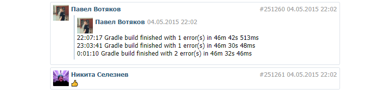
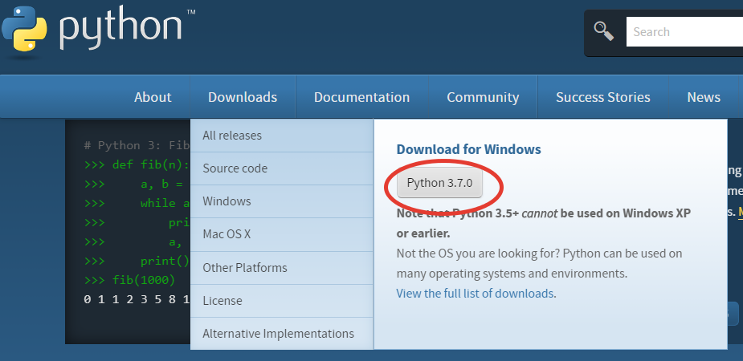
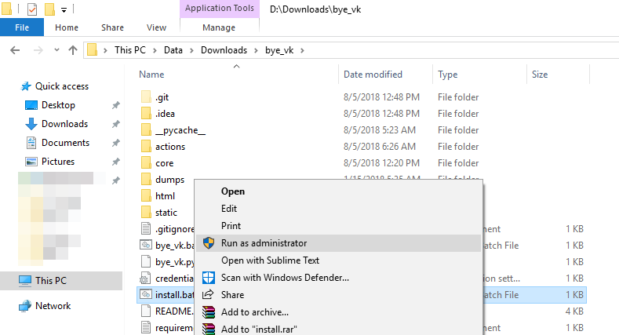
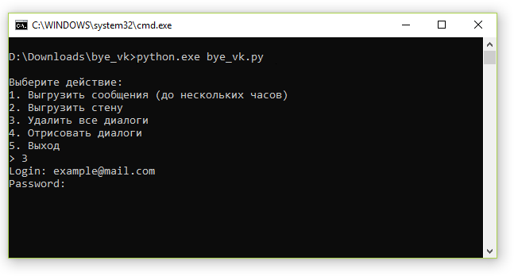
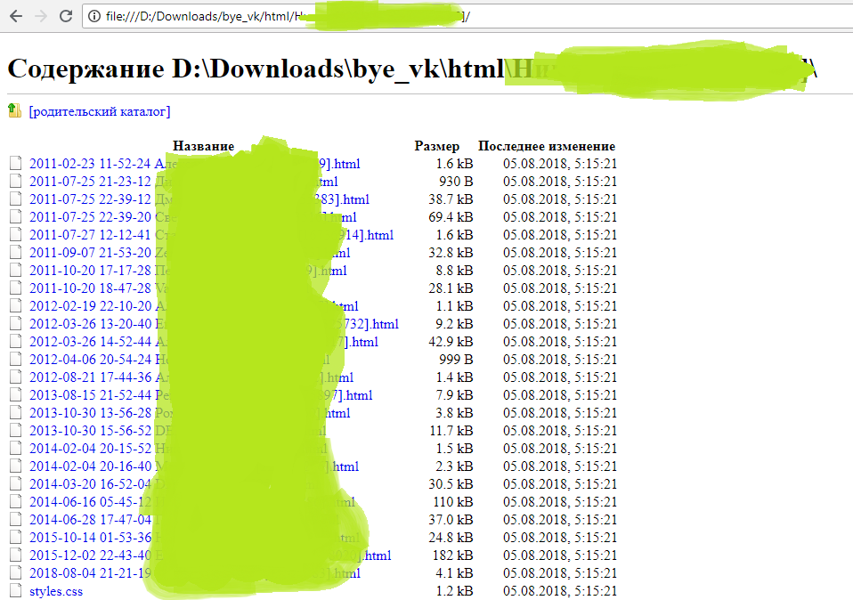
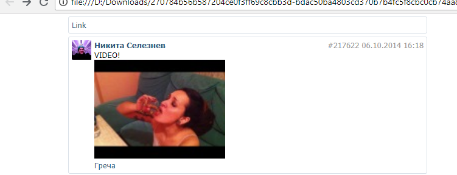

# Bye vk

## Intro

Причины выпилиться из соц.сетей могут быть разными.
 * Каждый день в России заводят уголовные дела за лайки, репосты и
 картинки в ВК и Одноклассниках. Если Вы считаете, что Вас не за что
 привлечь, пройдёмте, гражданин, [по ссылочке](https://medialeaks.ru/2907bva-idyom-na-posadku/),
  там расскажут 
 * Более глобальная
 [причина](https://vc.ru/43175-pochemu-stoit-udalit-vse-akkaunty-v-socialnyh-setyah):
  нежелание быть лабораторной крысой для алгоритмов предсказания/предопределения поведения людей в социальных сетях

## Функционал

1. Выгрузить:
 * все переписки вместе с фото (видео только по ссылке)
 * всю стену с фото
 * альбомы с комментариями
 * видеозаписи с комментариями
 * закладки
2. Удалить:
 * все переписки
 * стену
 * альбомы
 * видеозаписи
 * закладки (лайки) [TODO Links, Users, MarketItems]
3. Отрисовать переписки как простейшие html-страницы

Код частично заимствован, сделан на тяп-ляп. python3

Первоочередная задача -- выкачать всё ценное и удалить из вк, а уж отрисовать историю,
чтобы предаться ностальгическим чувствам -- дело десятое. Кстати, помощь приветствуется, пока что рендерится большой html под каждый диалог, который выглядит примерно так:



## Установка

1. Для работы необходим интерпретатор языка python 3 [Скачать](https://www.python.org/) (Downloads -> Ваша ОС -> Latest Python 3 Release)


2. [Скачать архив](https://github.com/neseleznev/bye_vk/archive/master.zip) с кодом программы, распаковать его

3. Установить зависимости (install.bat от имени администратора)



4. Кликнуть по bye_vk.bat







## Для продвинутых

```
$ git clone https://github.com/neseleznev/bye_vk
$ pip3 install -r requirements.txt
$ python3 bye_vk.py
```


______________________________________________________

           DO WHAT THE FUCK YOU WANT TO PUBLIC LICENSE
                   Version 2, December 2004

Copyright (C) 2004 Sam Hocevar <sam@hocevar.net>

Everyone is permitted to copy and distribute verbatim or modified
copies of this license document, and changing it is allowed as long
as the name is changed.

           DO WHAT THE FUCK YOU WANT TO PUBLIC LICENSE
  TERMS AND CONDITIONS FOR COPYING, DISTRIBUTION AND MODIFICATION

 0. You just DO WHAT THE FUCK YOU WANT TO.

